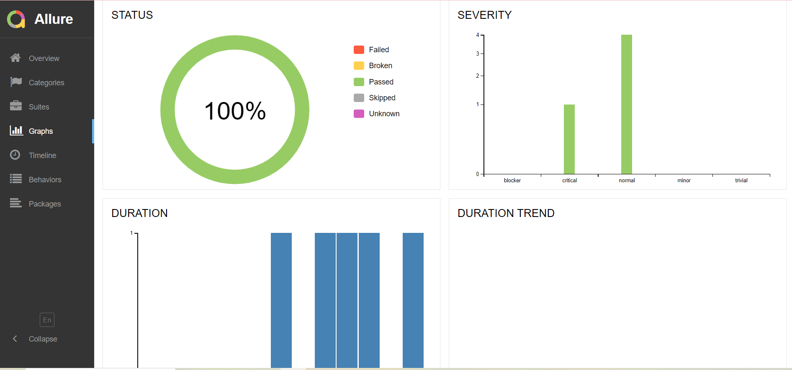

# Демо проект автоматизации тестирования сайта [Уфанет.ру](https://ufanet.ru/)
___
## Проект представляет собой набор UI-тестов покрывающих следующий функционал:
1. Авторизация
2. Переключение контента на странице
3. Проверка корректного перехода между страницами
___
## Используемый стек:

Проект написан на языке программирования Python, с использованием фреймворков Pytest, Selene. 

Реализована удаленная сборка тестов в Jenkins.

Запуск тестов в Selenoid.

После прохождения тестов система отправляет краткий отчет в *Telegram*.

Так же в Jenkins будет доступен подробный отчет Allure.

### Главная страница Allure-отчета

### Детализация шагов

### Графики прохождения тестов

## Уведомления в Telegram с использованием бота

> После завершения сборки специальный бот, созданный в <code>Telegram</code>, автоматически обрабатывает и отправляет сообщение с отчетом о прогоне.

## Пример запуска теста в Selenoid

> К каждому тесту в отчете прилагается видео. Одно из таких видео представлено ниже.

  

